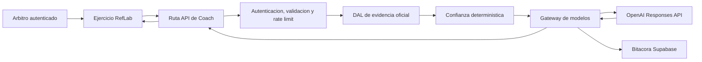

# Fundacion RefLab Coach

## Que construimos

Esta fundacion convierte las funciones de IA existentes en una capacidad segura y
trazable de RefLab. Todavia no crea el Coach conversacional visible. Primero crea
el sistema sobre el que ese producto puede crecer sin cajas negras.

La decision principal es mantener un **monolito modular**:

- RefLab sigue siendo una sola aplicacion Next.js.
- `lib/coach` funciona como un dominio interno independiente.
- Las pantallas no llaman directamente a OpenAI.
- Las rutas API autentican y validan cada solicitud.
- Supabase registra ejecuciones, evidencia y consumo.
- El modelo explica; RefLab calcula y verifica.

Separar ahora un microservicio agregaria despliegues, redes y observabilidad sin
resolver un problema real de escala. La frontera `lib/coach` permite extraerlo en
el futuro si el volumen lo justifica.

## Flujo completo



El navegador envia la respuesta del arbitro y un `clipId`. Nunca decide cual es
la respuesta correcta. El servidor recupera el clip correspondiente a la
disciplina activa, construye la evidencia y recien entonces solicita una
explicacion al modelo.

## Regla de confianza

El modelo no elige su propia confianza. `confidence.ts` la calcula con reglas
auditables:

- `high`: toda la evidencia es oficial, versionada, revisada, tiene referencia y
  la muestra minima fue alcanzada.
- `medium`: existe evidencia oficial, pero falta parte de la trazabilidad.
- `human_review`: no hay evidencia oficial suficiente o la muestra es pequena.

Esto evita que una respuesta redactada con seguridad aparente sea presentada
como una conclusion confiable.

## Privacidad

La fundacion aplica minimizacion de datos:

- No guarda prompts completos.
- No guarda respuestas completas del modelo.
- Guarda hashes SHA-256 para correlacion y auditoria.
- Guarda una copia estructurada de la evidencia utilizada.
- Usa `store: false` al llamar a OpenAI.
- Las credenciales existen solo en servidor.
- Los datos mentales y planes personales son privados por defecto.
- Una institucion solo recibe los indicadores expresamente consentidos.

Los detalles psicologicos y medicos no entran al Coach por defecto. Su uso futuro
necesitara consentimiento especifico y una experiencia visible para el usuario.

## Archivos del nucleo

### `lib/coach/types.ts`

**Por que existe:** define el idioma comun del dominio Coach.

**Para que sirve:** declara funciones, evidencia, confianza y contratos de
entrada/salida del gateway.

**Como se conecta:** lo consumen seguridad, evidencia, gateway, esquemas y rutas.

**Cuando se ejecuta:** los tipos desaparecen al compilar; no agregan trabajo en
produccion.

**Dependencias:** solo los tipos de disciplina de RefLab.

**Como modificarlo:** agregar una funcion nueva primero en `CoachFeature` y luego
autorizarla en la migracion SQL.

### `lib/coach/security.ts`

**Por que existe:** ninguna llamada paga o sensible debe ser publica.

**Para que sirve:** autentica con Clerk, limita el cuerpo, genera `requestId` y
consume el rate limit atomico de Supabase.

**Como se conecta:** es el primer paso de cada ruta Coach.

**Cuando se ejecuta:** en cada solicitud HTTP, exclusivamente en Node.js.

**Dependencias:** Clerk, Supabase Admin y la funcion SQL
`consume_coach_rate_limit`.

**Como modificarlo:** ajustar limites mediante variables de entorno; no quitar la
autenticacion ni reemplazar el limite durable por memoria local en produccion.

### `lib/coach/evidence.ts`

**Por que existe:** el navegador no puede ser fuente de verdad reglamentaria.

**Para que sirve:** busca clips de la disciplina correcta y produce un DTO minimo
con referencia, version, autoridad y resolucion.

**Como se conecta:** las rutas pasan esa evidencia al gateway y a la bitacora.

**Cuando se ejecuta:** despues de autenticar y antes de llamar al modelo.

**Dependencias:** Supabase Admin y el registro central de disciplinas.

**Como modificarlo:** agregar un cargador separado para documentos oficiales; no
mezclar consultas de navegador ni devolver campos privados.

### `lib/coach/confidence.ts`

**Por que existe:** la confianza debe depender de hechos, no de la redaccion del
modelo.

**Para que sirve:** transforma calidad de evidencia y tamano de muestra en una
etiqueta explicable.

**Como se conecta:** cada ruta calcula confianza antes de invocar el gateway.

**Cuando se ejecuta:** en servidor y en pruebas unitarias.

**Dependencias:** ninguna dependencia de infraestructura.

**Como modificarlo:** cambiar umbrales mediante una decision de producto
documentada y agregar la prueba correspondiente.

### `lib/coach/gateway.ts`

**Por que existe:** evita instancias y configuraciones de OpenAI dispersas.

**Para que sirve:** usa Responses API, Structured Outputs, timeout, reintento,
`store: false`, identificador de seguridad, auditoria y registro de tokens.

**Como se conecta:** recibe evidencia ya verificada y un esquema de salida.

**Cuando se ejecuta:** solo despues de superar seguridad y validacion.

**Dependencias:** SDK oficial de OpenAI y Supabase Admin.

**Como modificarlo:** un cambio de proveedor debe implementar esta misma
responsabilidad sin cambiar las rutas ni la UI.

### `lib/coach/schemas.ts`

**Por que existe:** texto libre no es un contrato confiable entre un modelo y la
aplicacion.

**Para que sirve:** define JSON Schema estricto y vuelve a validar la respuesta.

**Como se conecta:** el gateway lo envia al proveedor y la ruta formatea el
resultado para la interfaz actual.

**Cuando se ejecuta:** al recibir la respuesta del modelo.

**Dependencias:** tipos y errores de Coach.

**Como modificarlo:** agregar campos requiere actualizar schema, parser y UI.

### `lib/coach/input.ts`

**Por que existe:** todos los datos del cliente son no confiables.

**Para que sirve:** valida tipos, longitudes, rangos y cantidad de elementos.

**Como se conecta:** las rutas construyen DTOs pequenos antes de usar datos.

**Cuando se ejecuta:** inmediatamente despues de leer JSON.

**Dependencias:** errores de validacion de Coach.

**Como modificarlo:** incorporar validadores reutilizables, nunca coerciones
silenciosas de datos sensibles.

### `lib/coach/errors.ts`

**Por que existe:** un error interno puede revelar estructura o credenciales.

**Para que sirve:** separa el mensaje tecnico del mensaje seguro para el usuario.

**Como se conecta:** todas las rutas terminan en `coachErrorResponse`.

**Cuando se ejecuta:** ante validacion, limite, configuracion, evidencia o falla
del proveedor.

**Dependencias:** `NextResponse`.

**Como modificarlo:** cada nuevo error debe tener codigo estable, HTTP correcto y
mensaje publico sin detalles internos.

### `lib/coach/development-snapshot.ts`

**Por que existe:** Dashboard, Perfil y Coach necesitan la misma verdad tecnica.

**Para que sirve:** carga intentos de una sola disciplina y reutiliza el motor
central de metricas para producir resumen, radar, criterios y plan.

**Como se conecta:** sera una herramienta de lectura del Coach y la base para
migrar gradualmente las pantallas a un DTO de servidor.

**Cuando se ejecuta:** solo cuando una funcion server-side solicita el estado de
desarrollo de un usuario.

**Dependencias:** Supabase Admin y `performanceBySport`.

**Como modificarlo:** agregar fuentes reales al DTO; nunca calcular una metrica
alternativa dentro del Coach.

## Rutas migradas

- `app/api/ai-feedback/route.ts`: feedback tecnico por clip.
- `app/api/ai-exam-analysis/route.ts`: patron de examen recalculado en servidor.
- `app/api/english-feedback/route.ts`: comunicacion estructurada.
- `app/api/var-feedback/route.ts`: protocolo VAR basado en el clip verificado.

Las rutas mantienen `feedback` y `scores` para no romper las interfaces actuales,
pero ahora agregan:

- `coachRunId`
- `confidence`
- `evidence`

## Base de datos

La migracion `202607200001_reflab_coach_foundation.sql` crea:

- `coach_runs`: estado y trazabilidad de cada ejecucion.
- `coach_evidence`: evidencia exacta usada por una ejecucion.
- `ai_usage_ledger`: tokens por funcion y modelo.
- `coach_data_consents`: consentimiento por categoria y finalidad.
- `coach_rate_limit_buckets`: limite durable por usuario y funcion.
- `consume_coach_rate_limit`: operacion atomica para evitar carreras.

Todas tienen RLS y acceso exclusivo del servidor. No se altera ni elimina ninguna
tabla historica.

El rollback esta en
`supabase/rollbacks/202607200001_reflab_coach_foundation.rollback.sql`. El
rollback elimina solamente objetos de esta fundacion y tambien elimina su
bitacora; debe usarse unicamente con una decision consciente.

## Variables

```dotenv
OPENAI_API_KEY=
REFLAB_COACH_MODEL=gpt-4o-mini
COACH_RATE_LIMIT_MAX=20
COACH_RATE_LIMIT_WINDOW_SECONDS=600
COACH_MAX_BODY_BYTES=65536
```

`OPENAI_API_KEY` nunca debe usar prefijo `NEXT_PUBLIC_`.

## Que falta antes del Coach conversacional

1. Aplicar y verificar la migracion en un entorno de prueba.
2. Crear una API de consentimiento visible para el usuario.
3. Versionar e ingerir documentos oficiales con citas por fragmento.
4. Exponer el snapshot tecnico como una herramienta de solo lectura.
5. Disenar conversaciones, memoria resumida y borrado.
6. Crear evaluaciones de calidad, seguridad y alucinacion.
7. Definir presupuesto mensual y alertas de costo.

La siguiente etapa no debe comenzar hasta validar esta fundacion con datos reales
de prueba y aprobar el alcance del Coach Conversacional.
